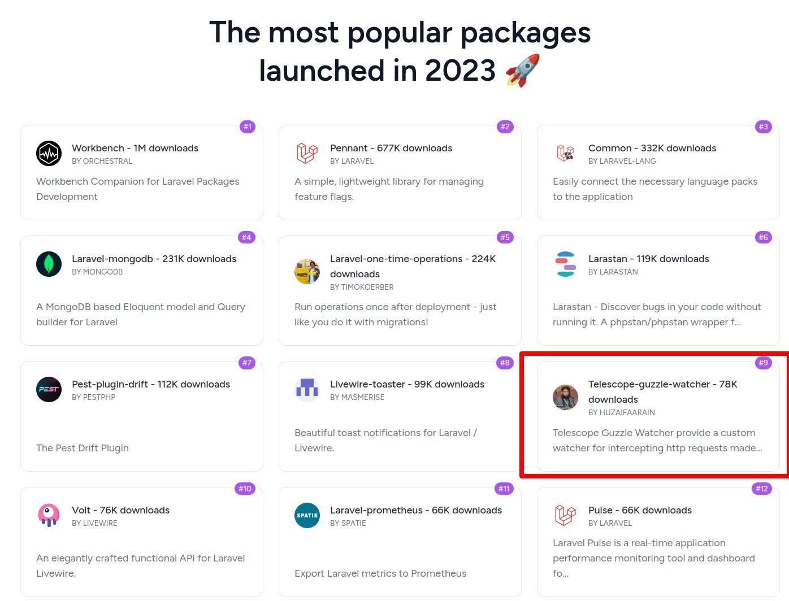

    <h2>✍ Solutions Architect | 👨‍💻 Lead Software Engineer | 🚀 PHP | 💪 Laravel | 👌 Symfony | 🏆 Linux Certified |
        🏆 NodeJS Certified | 👌 Docker | 🚀 Open Source Contributor</h2>
    

        
        
    

    
A seasoned Software Engineer with over a decade of expertise in PHP, specializing in Laravel, and certified as a
        NodeJS Developer by the OpenJS Foundation.

    <h2 class="section-heading">🌐 Connect with Me</h2>
    
 To connect with me, you can find my professional profile and contact details on LinkedIn, or explore more about
        my projects and interests through my Linktree. Feel free to reach out for collaborations, opportunities, or just
        to exchange ideas about the latest in software development and technology. Let's innovate together! 

    

        
        
        
        
        
    

    <h2 class="section-heading">Core Expertise</h2>
    

        
        
        
        
        
        
        
    

    <h2 class="section-heading">Cloud Technologies</h2>
    

        
        
        
    

    <h2 class="section-heading">Operating Systems</h2>
    

        
        
        
    

    <h2 class="section-heading">Frameworks/Libraries/Tools</h2>
    

        
        
        
        
        
        
        
        
        
        
        
        
        
        
    

    <h2 class="section-heading">API Integrations</h2>
    

        
        
        
        
        
    

<h2 class="section-heading">Author of <a href="https://github.com/huzaifaarain/telescope-guzzle-watcher"
        target="_blank">Laravel Telescope
        Guzzle Watcher</a></h2>

    

    <h2>🎓 Education:</h2>
    <ul>
        <li>👨‍🎓 Currently pursuing M.Phil in Computer Science (expected completion in 2025) at the National
            University
            of
            Computer and Emerging Sciences.</li>
        <li>👨‍🎓 Holds a Bachelor's degree in Computer Science from Preston University Karachi (2018).</li>
        <li>
            💪 Interested in Software Architecture, Design Patterns, and Multi-Tenancy SAAS Architecture
        </li>
    </ul>
    

    <h2>🏆 Certifications:</h2>
    <ul>
        <li>📄 Certified in Node.js Application Development by The Linux Foundation.</li>
        <li>📄 Awarded the LiFT Scholarship (The Linux Foundation) in 2021.</li>
    </ul>
    

