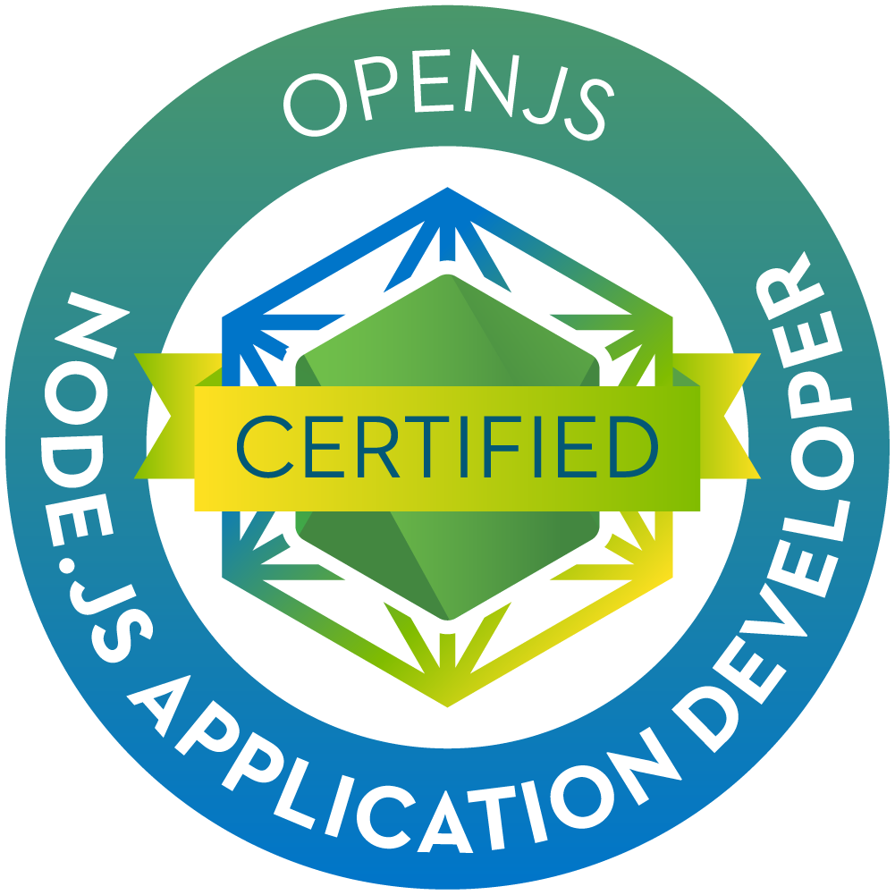

### Hi there, I'm Muhammad Huzaifa 👋

 
 
<code></code>
<code></code>
 
 

 
 

Hi, I'm Muhammad Huzaifa, student of computer science from Pakistan 🇵🇰 .

- 🔭 Working on PHP/MySQL, Laravel, WordPress, JavaScript, NodeJS, Vue 3, Linux Administration, Docker, Microservice & Monolithic Architect

**Languages, Frameworks, Operating System and Tools:**  

<code></code>
<code></code>
<code></code>
<code></code>
<code></code>
<code></code>
<code></code>
<code></code>
<code></code>
<code></code>
<code></code>
<code></code>
<code></code>

 
 

 
 

 
 

 

 
